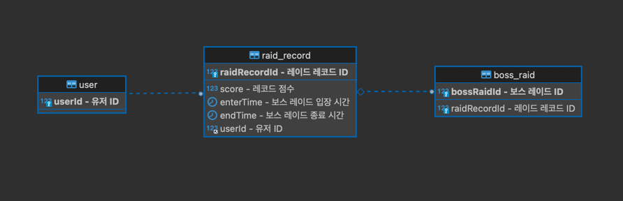
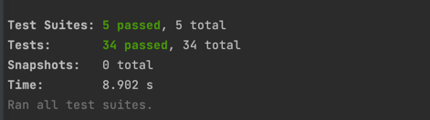

:doctype: book
:icons: font
:source-highlighter: highlightjs
:toc: left
:toclevels: 3
:sectlinks:

== 개요

* 보스레이드를 통한 랭킹 시스템 구현

== 사용 기술

* NestJS, MySQL, Redis, TypeORM

== 요구사항 분석

=== 유저
* 유저 생성
** 유저 생성시 아무 값도 받지 않음
** 유저는 따로 가입절차를 밟지 않고 레이드 시작 전에 중복되지 않는 userId를 발급받음 (유저 인증 절차는 구현하지 않음)
* 유저 조회 (해당 사용자의 레이드 기록 조회)
** 해당 사용자의 totalScore 와 레이드 기록들을 반환
** totalScore 는 레이드 기록들의 score 총합

=== 보스 레이드
* 레이드 상태 조회
** 진행중인 레이드 레코드가 있는지 확인한다.
*** 레이드를 시작할 수 있는 경우
*** 진행중인 레코드가 없는 경우
*** 연결된 레코드의 종료시간이 있는 경우 (레이드가 종료되어 있음)
*** 요청 시점이 연결된 레코드의 시작시점 + 레이드 제한 시간 이후인 경우
**** 이전 레이드가 제한시간을 초과되어 종료된 상태
** 입장 가능 상태와 레이드 진행중인 유저의 userId 를 반환
*** 입장 가능 상태인 경우 userId 의 값은 null

* 레이드 시작
** 레이드를 시도하는 유저의 userId 와 레벨을 입력받아 레이드 시작을 요청
** 레이드를 시작할 수 있다면 새 레코드를 생성하고 입장 가능 상태와 해당 레코드 id 값을 반환한다.
*** 레코드 생성시 레벨에 해당하는 점수를 레코드에 기록해둔다.
** 응답 값으로 입장 가능 상태와 raidRecordId 를 발급받는다.
** 레이드는 레벨에 상관없이 오직 하나의 유저만 진행 가능
*** 레이드가 진행중이면 다른 레벨이라도 새로 진행할 수 없으며 진행중인 레이드가 끝날 때까지 대기

* 레이드 종료
** 레이드에 성공했다면 레이드를 종료 처리함
*** 요청시 레이드를 수행한 userId 와 raidRecordId 를 서버에 전달
*** 요청한 시간과 시작시간, 레이드 수행 시간을 통해 성공 / 실패를 판별한다.
**** 성공한 경우 레코드에 레이드 종료 시간을 기록한다.
**** 실패한 경우 해당 기록을 제거한다.

=== 랭킹 조회
* 랭킹 조회
** 랭킹 조회시 userId 를 받음
** 응답 값으로 탑 랭커 기록들과 userId 의 개인 기록을 받아옴
*** 랭크(순위) 기준은 totalScore 을 기준으로 함

== 테이블 설계

== API
=== 유저
* 유저 생성
|===
|Method|URL|Response

|POST
|/user
|status : 201

|===

* 유저 조회
|===
|Method|URL|Request Path|Response

|GET
|/user:userId
|userId : 유저 ID
|status : 200 +
totalScore : 레이드 총 점수 +
bossRaidHistory : { +
raidRecordId : 레이드 레코드 ID +
score : 레이드 레코드 점수 +
enterTime : 보스레이드 입장시간 +
endTime : 보스레이드 종료시간 +
} []

|===

=== 보스레이드
* 레이드 상태 조회
|===
|Method|URL|Response

|GET
|/bossRaid
|status: 200 +
canEnter : 보스레이드 입장가능 여부
enteredUserId : 보스레이드 진행중인 유저 ID

|===

* 레이드 시작
|===
|Method|URL|Request Body|Response

|POST
|/bossRaid/enter
|userId : 유저 ID +
lever : 보스레이드 난이도
|status : 201 / 200 +
isEntered : 입장 성공 여부
raidRecordId : 보스레이드를 진행하는 레이드 레코드 ID

|===

* 레이드 종료
|===
|Method|URL|Request Body|Response

|PATCH
|/bossRaid/end
|userId : 보스레이드 종료를 요청한 유저 ID +
raidRecordId : 보스레이드를 종료할 레코드 ID
|status : 200

|===

=== 랭킹 조회
|===
|Method|URL|Request Body|Response

|GET
|/bossRaid/topRankerList
|userId : 유저 ID
|status : 200 +
myRankingInfo : { +
ranking : 순위 +
userId : 유저 ID +
totalScore : 총 점수 +
} +
topRankerInfoList : 탑랭크 목록

|===

== 테스트

=== 테스트 코드
* link:https://github.com/MisterRuby/bossRaid/tree/develop/test/domain/user[유저]
* link:https://github.com/MisterRuby/bossRaid/tree/develop/test/domain/bossRaid[보스레이드]
* link:https://github.com/MisterRuby/bossRaid/tree/develop/test/domain/raidRecord[랭킹 조회]

=== 테스트 전체 실행 결과

